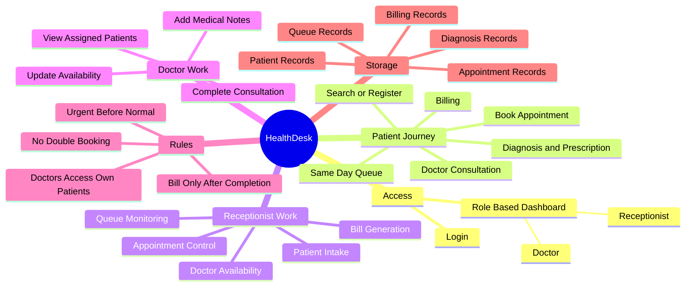
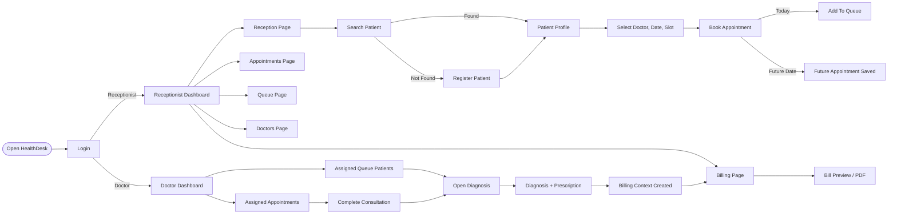
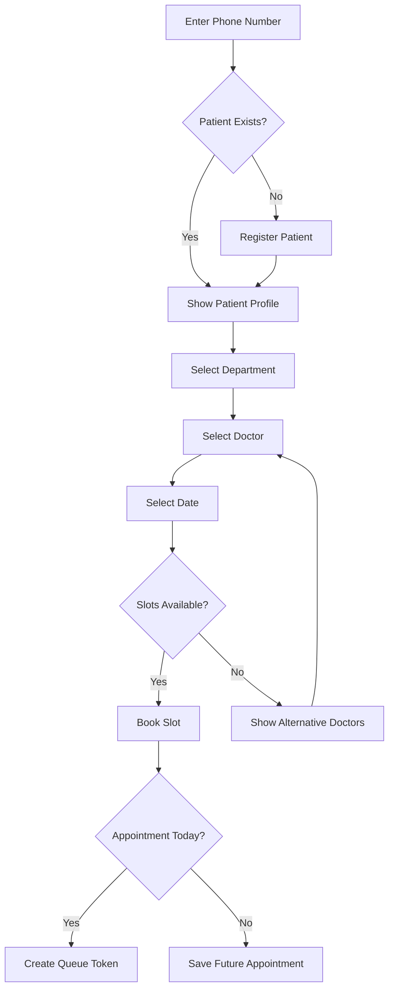
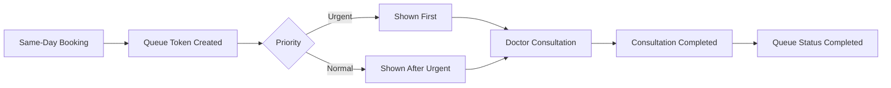
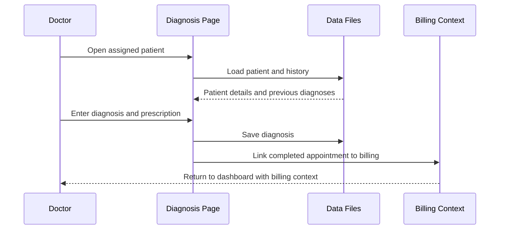
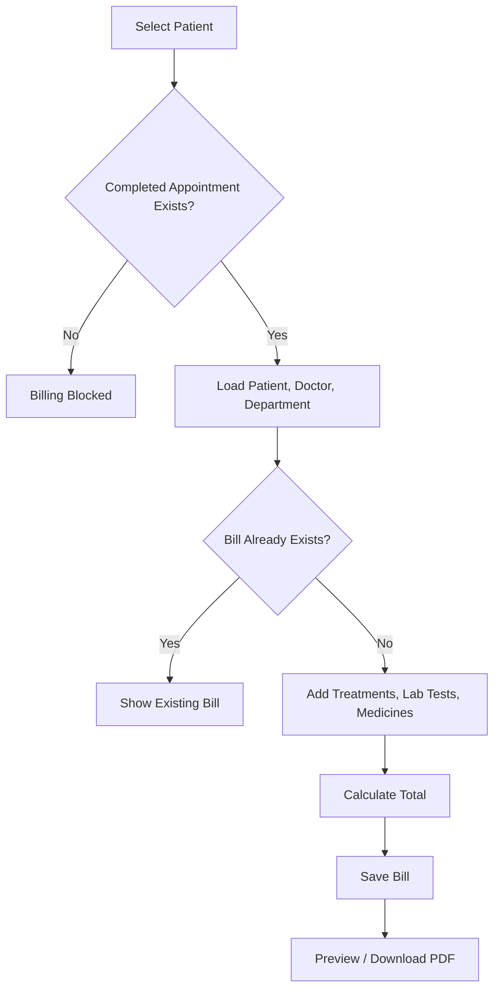
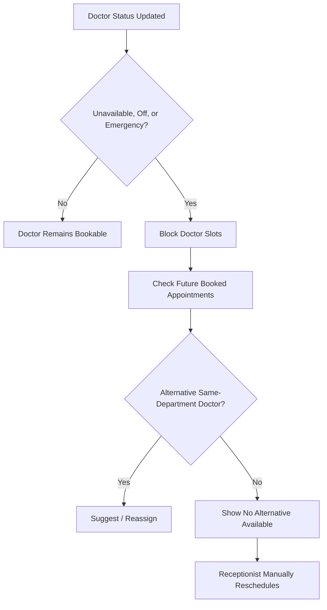

# HealthDesk Complete System Flow

This document explains the HealthDesk workflow from a user perspective. It focuses on what happens on each page and how the receptionist, doctor, queue, diagnosis, appointment, and billing flows connect.

## Quick Mind Map

Use this as the one-screen overview before explaining the detailed flow.



## Big Picture Flow



## Demo Choreography

This sequence works well when presenting the system to teammates or evaluators.

```text
Scene 1: Login
Show that the same system opens different dashboards based on role.

Scene 2: Receptionist Intake
Search by phone, register a new patient if needed, then book an appointment.

Scene 3: Queue Movement
Book a same-day appointment and show the queue token being created.

Scene 4: Doctor Consultation
Log in as the doctor, complete the appointment, and open diagnosis.

Scene 5: Diagnosis To Billing
Save diagnosis and prescription, then show that billing becomes available.

Scene 6: Exception Handling
Mark a doctor unavailable, show blocked slots, and show alternative doctors.
```

<details>
<summary><strong>Presentation Tip: Make It Feel Animated</strong></summary>

When sharing this file, reveal it section by section instead of scrolling all at once:

1. Start with the mind map.
2. Move to the big picture flow.
3. Demonstrate the receptionist journey.
4. Demonstrate the doctor journey.
5. Finish with billing and data flow.

This gives the walkthrough a natural "animation" effect even in plain Markdown.

</details>

## 1. Login Flow

1. User opens the HealthDesk system.
2. User enters username and password.
3. System checks the login account.
4. If the user is a receptionist, the system opens the receptionist dashboard.
5. If the user is a doctor, the system opens the doctor dashboard.
6. If credentials are wrong, login fails and the user remains on the login page.

## 2. Receptionist Dashboard Flow

The receptionist dashboard is the starting point for reception staff.

It shows:

- Waiting patient count
- Completed patient count
- Booked appointment count
- Cancelled appointment count
- Available doctor count
- Next patient in queue

From here, the receptionist can go to:

- Reception
- Appointments
- Queue
- Doctors
- Billing

## 3. Reception Page Flow

The reception page is used for patient intake and appointment booking.



1. Receptionist enters the patient's phone number.
2. System searches existing patient records.
3. If the patient exists, the patient profile is shown.
4. If the patient does not exist, the registration form is shown.
5. Receptionist registers the patient with name, age, gender, phone, address, symptoms, visit type, priority, and department.
6. After registration, the patient profile appears.
7. Receptionist selects department, doctor, and appointment date.
8. System shows doctor information and available slots.
9. If the selected doctor is unavailable, off, or in emergency status, slots appear blocked.
10. System suggests alternative doctors from the same department when available.
11. Receptionist selects an available slot.
12. Appointment is booked.
13. If the appointment is for today, the patient is added to the queue.
14. System shows booking confirmation and queue token if created.

## 4. Appointment Flow

The appointments page is used to view, book, cancel, and reschedule appointments.

1. Receptionist opens the appointments page.
2. Receptionist filters by department, doctor, and date.
3. System shows the slot board for the selected doctor.
4. Available slots can be booked by entering a patient ID.
5. Booked, completed, cancelled, rescheduled, no-show, and blocked slots are displayed.
6. If a doctor/date/time slot is already booked, the same slot cannot be booked again.
7. Receptionist can cancel an appointment.
8. Receptionist can reschedule an appointment.
9. Rescheduling marks the old appointment as `Rescheduled` and creates a new `Booked` appointment.
10. Receptionist can mark appointments as completed or no-show when needed.
11. If a doctor becomes unavailable, the system checks for alternative doctors in the same department.

## 5. Queue Flow

The queue manages same-day patients waiting for consultation.



1. A patient is added to the queue when a same-day appointment is booked.
2. Queue stores token, patient ID, doctor ID, priority, and status.
3. Urgent patients are shown before normal patients.
4. Receptionist can view waiting and completed queue counts.
5. Receptionist can serve the next patient.
6. When a doctor completes consultation, the patient's queue status becomes completed.
7. Cancelled or rescheduled same-day appointments update the related queue entry so stale patients do not remain waiting.

## 6. Doctor Management Flow

The doctors page is used by the receptionist to manage doctor profiles and availability.

1. Receptionist opens the doctors page.
2. System lists doctors with department, experience, daily status, current status, and login username.
3. Receptionist can add a new doctor.
4. When a doctor is added, a doctor login account is created.
5. Receptionist can update doctor availability.
6. Daily status can be available, unavailable, or off.
7. Current status can be free, busy, or emergency.
8. If a doctor is unavailable, off, or in emergency status, appointment slots are blocked.
9. The system attempts to suggest or reassign future appointments to alternative doctors in the same department.

## 7. Doctor Dashboard Flow

The doctor dashboard is the starting point for doctors.

It shows:

- Assigned appointments
- Assigned queue patients
- Doctor availability controls
- Billing context after diagnosis, when available

Assigned appointments flow:

1. Doctor sees appointment ID, patient ID, date, slot, and status.
2. Doctor clicks complete and diagnose.
3. System checks that the appointment belongs to the logged-in doctor.
4. Appointment becomes completed.
5. Queue entry becomes completed if the patient was waiting.
6. Doctor is sent to the diagnosis page.

Queue patients flow:

1. Doctor sees queue token, patient ID, patient name, and priority.
2. Urgent patients appear first.
3. Doctor opens diagnosis for the assigned patient.

Availability flow:

1. Doctor updates daily status and current status.
2. If doctor becomes unavailable, off, or emergency, future booked appointments may be reassigned if alternatives exist.

## 8. Diagnosis Flow

The diagnosis page is used by doctors to review patient history and record consultation details.



1. Doctor opens diagnosis page for an assigned patient.
2. System shows patient details.
3. System shows previous diagnosis history.
4. Doctor enters diagnosis.
5. Doctor enters prescription.
6. Doctor saves the record.
7. Diagnosis is stored.
8. System links the consultation to billing through the completed appointment.
9. Doctor returns to dashboard with billing context available.

## 9. Billing Flow

Billing is handled by the receptionist after consultation is completed.



1. Receptionist opens the billing page.
2. Receptionist selects a patient.
3. System checks the patient's latest completed appointment.
4. If there is no completed appointment, billing is blocked.
5. If a completed appointment exists, billing details are loaded.
6. System links billing to the completed appointment, doctor, department, and patient.
7. Receptionist can add treatments, lab tests, medicine amount, medicine notes, and payment status.
8. System calculates doctor fee, treatment total, lab total, medicine total, and final total.
9. Bill is saved.
10. If a bill already exists for the completed appointment, duplicate billing is prevented.
11. Receptionist can preview and download the bill PDF.

## 10. Complete End-To-End Patient Flow

This is the normal full patient journey.

1. Receptionist logs in.
2. Receptionist searches patient by phone.
3. If patient is new, receptionist registers patient.
4. Receptionist selects department and doctor.
5. Receptionist selects date and available slot.
6. Appointment is booked.
7. If appointment is today, patient is added to queue.
8. Doctor logs in.
9. Doctor sees assigned appointment or assigned queue patient.
10. Doctor completes consultation.
11. Doctor adds diagnosis and prescription.
12. System creates billing context.
13. Receptionist opens billing.
14. Receptionist generates bill.
15. Bill can be previewed or downloaded.

## 11. Unavailable Doctor Flow

This flow happens when a doctor cannot take appointments.



1. Receptionist or doctor updates doctor status to unavailable, off, or emergency.
2. System blocks that doctor's slots.
3. Existing future booked appointments are checked.
4. System searches same-department doctors.
5. If an alternative doctor has the same slot available, appointment can be reassigned.
6. If no alternative exists, system shows that no suitable doctor is available.
7. Receptionist can manually choose another doctor or reschedule.

## 12. Cancel Flow

1. Receptionist opens appointments page.
2. Receptionist selects the appointment.
3. Receptionist cancels it.
4. Appointment status becomes `Cancelled`.
5. If the patient was waiting in queue for that appointment, queue status is updated.
6. The slot becomes available again for future booking.

## 13. Reschedule Flow

1. Receptionist opens appointments page.
2. Receptionist selects the appointment.
3. Receptionist enters new date and time.
4. System checks whether the new slot is available.
5. Old appointment becomes `Rescheduled`.
6. New appointment is created as `Booked`.
7. If the new appointment is today, patient is added to queue.
8. If the patient had a waiting queue entry for the old appointment, it is marked rescheduled.

## 14. No-Show Flow

1. Appointment exists but patient does not arrive.
2. Receptionist marks appointment as no-show.
3. Appointment status becomes `No-show`.
4. Queue entry is updated if needed.
5. The slot is not treated as a normal completed consultation.

## 15. Billing Rule

Billing is allowed only after an appointment is completed.

If a patient has a future booked appointment but also has a completed appointment, the system bills the latest completed appointment, not the future booking.

## 16. Data Flow Summary

- Patient registration updates `Backend/data/patients.txt`.
- Appointment booking, cancellation, reschedule, completion, and no-show update `Backend/data/appointment.txt`.
- Same-day booking and consultation status update `Backend/data/queue.txt`.
- Diagnosis updates `Backend/data/diagnosis.txt`.
- Billing updates `Backend/data/billing.txt`.
- Doctor availability updates `Backend/data/doctors.txt`.
- Login uses `Backend/data/users.txt`.

## 17. Final Flow Map

```text
Login
  -> Receptionist Dashboard
      -> Reception
          -> Search Patient
          -> Register Patient
          -> Select Department / Doctor / Date
          -> Book Appointment
          -> Add To Queue If Today
      -> Appointments
          -> View Slots
          -> Book
          -> Cancel
          -> Reschedule
          -> Mark Complete / No-show
          -> Handle Unavailable Doctor
      -> Queue
          -> View Waiting
          -> Urgent Before Normal
          -> Serve Patient
      -> Doctors
          -> Add Doctor
          -> Update Availability
          -> Suggest / Reassign Appointments
      -> Billing
          -> Select Completed Patient
          -> Generate Bill
          -> Preview / Download PDF

Login
  -> Doctor Dashboard
      -> View Assigned Appointments
      -> View Assigned Queue Patients
      -> Complete Consultation
      -> Diagnosis
          -> View History
          -> Add Diagnosis
          -> Add Prescription
          -> Trigger Billing Context
      -> Update Availability
```
