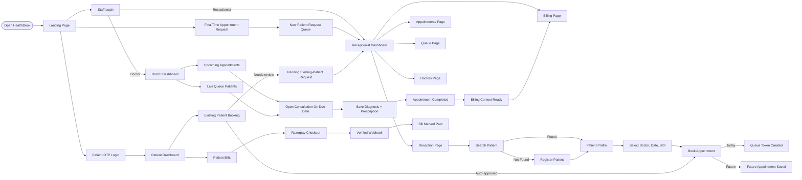
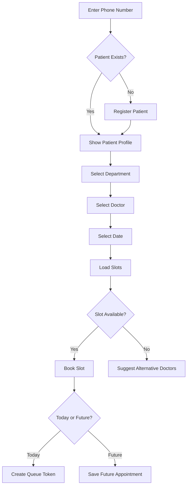
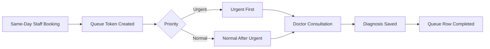
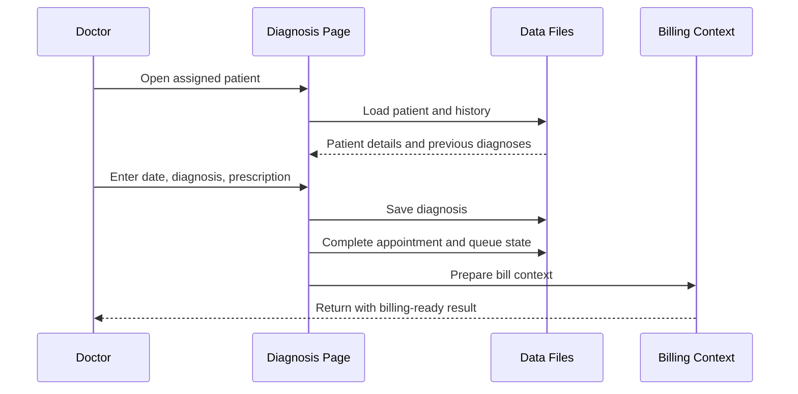
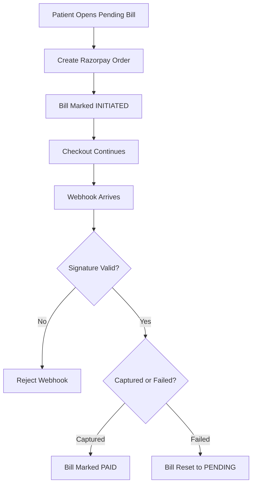
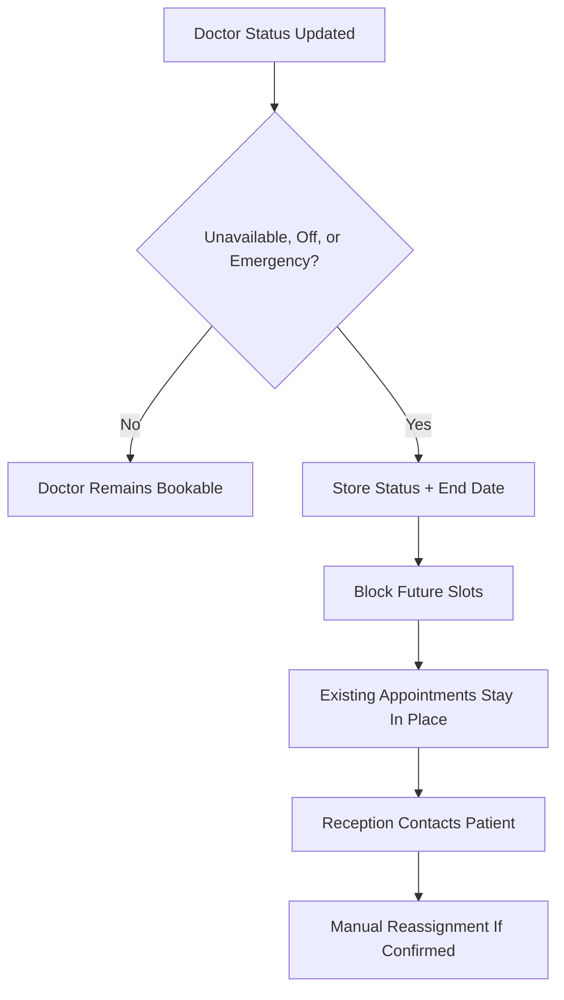

# HealthDesk Complete System Flow

Last updated: May 2026

This document explains the current HealthDesk workflow from a user and operations perspective. It focuses on what happens on each page, how the receptionist, doctor, patient, queue, diagnosis, appointment, and billing flows connect, and where the current guardrails live.

It is intended to be detailed enough for demos, handover, and review, without becoming as large as the older version.

## Big Picture Flow



## Demo Choreography

This sequence works well when presenting the system:

```text
Scene 1: Landing and login
Show staff login, patient OTP login, and first-time request entry.

Scene 2: Receptionist intake
Search for a patient, register one if needed, and book a same-day slot.

Scene 3: Queue movement
Show the queue token appearing and the patient entering the doctor queue.

Scene 4: Doctor consultation
Log in as the doctor, open diagnosis, and save diagnosis plus prescription.

Scene 5: Diagnosis to billing
Show that the consultation becomes completed and billing becomes available.

Scene 6: Patient portal
Log in as a patient, request a future slot, and show either pending review or auto-approval.

Scene 7: Payment
Open a pending bill from the patient dashboard and explain order creation plus webhook confirmation.

Scene 8: Exceptions
Show doctor unavailability, blocked slots, and receptionist-controlled reassignment.
```

## 1. Access And Login Flow

HealthDesk currently offers three access paths:

- staff login,
- patient OTP login,
- first-time appointment request.

### Staff login

1. Staff opens `/login`.
2. The user enters username and password.
3. Python reads `Backend/data/users.txt`.
4. The stored password is checked in Python.
5. Receptionists are redirected to `/receptionist_dashboard`.
6. Doctors are redirected to `/doctor`.
7. Invalid login stays on the same page with an error.

Important current rules:

- unsupported roles are rejected,
- a doctor account must be linked to a valid doctor ID,
- login is no longer delegated to `auth.exe`.

### Patient OTP login

1. Patient opens `/patient/login`.
2. Patient enters a registered 10-digit phone number.
3. Python verifies that the phone exists in `patients.txt`.
4. A six-digit OTP is generated and sent through the SMS service.
5. The OTP is stored only as a hash in memory.
6. The OTP expires after 5 minutes.
7. Three wrong attempts invalidate the OTP.
8. Successful verification creates a patient session and opens `/patient/dashboard`.

Important rule:

- this path is only for already registered patients.

## 2. Receptionist Dashboard Flow

The receptionist dashboard is the front-desk command center.

It provides:

- pending existing-patient booking requests,
- pending first-time requests,
- queue summary counts,
- appointment counts,
- doctor availability summary,
- quick links into the main operational pages.

### Pending request review

The dashboard now has active workflow responsibility, not just summary cards.

1. Existing-patient requests are loaded from `pending_appointments.txt`.
2. First-time requests are loaded from `new_patient_requests.txt`.
3. Reception can approve an existing-patient request.
4. Reception can register and approve a first-time request.
5. Reception can reject either kind of request.
6. Rejection requires a receptionist note.
7. Approval re-checks that the requested slot is still free before booking.

### What approval does

For an existing-patient request:

1. the slot is rechecked,
2. the appointment is booked,
3. the request is updated with final status and appointment ID,
4. the patient receives a confirmation SMS.

For a first-time request:

1. the slot is rechecked,
2. the patient record is created,
3. the appointment is booked,
4. the request is updated with final status, patient ID, and appointment ID,
5. the patient receives a confirmation SMS.

### Request expiry

- requests expire after 2 hours if not reviewed,
- expiry is processed through the pending-request module,
- expired requests generate notifications so the patient knows to submit again or call.

## 3. Reception Page Flow

The reception page is used for patient intake and staff-driven booking.



Detailed flow:

1. Receptionist enters a phone number.
2. The system looks up the patient.
3. If the patient exists, the profile is shown.
4. If the patient does not exist, the receptionist fills the registration form.
5. Registration captures name, age, gender, phone, address, symptoms, visit type, priority, and department.
6. After registration, the patient profile is reloaded.
7. Reception selects department, doctor, date, and slot.
8. The system loads doctor info, available slots, and alternative doctors when useful.
9. The selected date must be today or a future date.
10. Once booked, same-day appointments create a queue token.

Important current rule:

- only staff-driven same-day bookings create queue entries directly.

## 4. Appointments Page Flow

The appointments page is the operational control page for appointment maintenance.

It supports:

- slot browsing,
- patient-ID based booking,
- cancellation,
- reschedule,
- no-show,
- reassignment.

### Slot-board flow

1. Reception opens `/appointments`.
2. Reception chooses department, doctor, and date.
3. The system loads the doctor's slot board.
4. Available slots can be booked by entering a patient ID.
5. The page also shows a short seven-day availability overview for the selected doctor.

### Current appointment rules

1. A past date cannot be booked.
2. A past date cannot be used for reschedule.
3. If the slot is no longer available, the action is rejected.
4. Reception cannot complete a consultation from this page.
5. Consultation completion belongs to the doctor diagnosis flow.

### Reassignment flow

This flow is now more conservative than the older system notes.

1. Reception chooses a replacement doctor, date, and slot.
2. Patient confirmation must be recorded.
3. A short confirmation note is required.
4. The replacement slot is checked again before booking.
5. The replacement appointment is booked first.
6. The original appointment is cancelled only after the replacement booking succeeds.
7. If the replacement appointment is for today, a queue row is created for the new doctor.
8. The patient receives an SMS about the change.

Important rule:

- doctor unavailability does not silently auto-move booked patients anymore.

## 5. Queue Flow

The queue manages same-day patients who are ready for consultation.



Detailed flow:

1. Same-day staff booking creates a queue token.
2. Queue rows store token, patient ID, doctor ID, priority, and status.
3. Urgent rows are ordered before normal rows.
4. Reception sees grouped queues by doctor instead of one undifferentiated list.
5. Queue rows are reconciled against appointment state.
6. If an appointment is cancelled, rescheduled, completed, or marked no-show, the queue row is updated too.
7. When diagnosis is saved, the queue row becomes completed automatically.

Important rule:

- queue is not advanced by a manual "serve next" button; it stays consistent with appointment and diagnosis state.

## 6. Doctors Page Flow

The doctors page is the receptionist's doctor-management interface.

It supports:

- viewing the doctor directory,
- adding new doctors,
- showing generated login credentials,
- updating doctor status.

### Add-doctor flow

1. Reception enters doctor details.
2. If username or password is left blank, Python generates them.
3. The doctor profile is created through `doctor.exe`.
4. The login account is created in `users.txt`.
5. The generated credentials are shown back in the UI.

### Doctor status flow

1. Reception sets `daily_status` and `current_status`.
2. If the doctor is unavailable or off, an effective end date is also stored.
3. Python writes extra timing metadata to `doctor_status_meta.json`.
4. Future slots are blocked according to that metadata.

Important statuses:

- `daily_status`: `Available`, `Unavailable`, `Off`
- `current_status`: `Free`, `Busy`, `Emergency`

## 7. Doctor Dashboard Flow

The doctor dashboard is the doctor's operational home page.

It shows:

- doctor identity and current status,
- status update controls,
- live queue patients,
- future booked appointments,
- billing-result context after a diagnosis save.

### Upcoming appointments

1. The doctor sees booked future appointments.
2. These remain informational until their consultation day arrives.
3. Once due, the practical work moves into the live consultation flow.

### Live queue patients

1. The doctor sees same-day waiting patients assigned to them.
2. The list shows token, patient name, patient ID, and priority.
3. The doctor starts the consultation from this page.
4. The consultation opens in the diagnosis page with appointment context.

### Doctor self-status updates

1. The doctor can update daily status and current status.
2. Unavailable, off, and emergency states can block future dates.
3. Existing patients are not reassigned automatically.
4. Reception must still confirm changes with the patient before reassignment.

## 8. Diagnosis Flow

The diagnosis page is the doctor's consultation workspace.



Detailed flow:

1. The doctor opens consultation for an assigned patient.
2. The system loads patient context and diagnosis history.
3. The doctor enters consultation date, diagnosis, and prescription.
4. All of those fields are required.
5. If the appointment is still active, the system completes it.
6. The diagnosis record is saved to `diagnosis.txt`.
7. The queue row is marked completed.
8. Billing context is prepared automatically.
9. The doctor is redirected back with billing-related follow-up context.

Important rule:

- diagnosis save is what makes the consultation truly completed in the workflow.

## 9. Billing Flow

Billing is handled by reception after consultation completion.


Detailed flow:

1. Reception opens `/billing`.
2. The page loads patients, appointments, doctors, bills, and pricing data.
3. The system builds a billing lookup in Python.
4. Billing is allowed only if there is a completed appointment context.
5. If a bill already exists for that completed appointment, duplicate generation is blocked.
6. Reception selects treatments, lab tests, medicine amount, and notes.
7. Doctor fee comes from the pricing catalog.
8. Totals are calculated by Python.
9. The bill is saved through the billing helper.
10. The page shows a preview and PDF download option.

### Bill status behavior

Bills can be in statuses such as:

- `PENDING`
- `INITIATED`
- `PAID`
- `WAIVED`
- `REFUNDED`

Important rules:

- counter-paid bills record payment method and paid time,
- online payment uses `INITIATED` first,
- final online payment status comes only from webhook verification.

## 10. Existing Patient Portal Flow

The existing patient portal is now a full workflow, not just a read-only dashboard.

### Booking request flow

1. Patient logs in through OTP.
2. Patient opens `/patient/book`.
3. Patient chooses department, doctor or `any doctor`, future date, slot, reason, and visit type.
4. Python applies triage rules.

### Auto-approved path

Auto-approval happens only when:

- the request is submitted during clinic review hours,
- doctor availability does not require manual review,
- visit type is `New`.

If auto-approved:

1. the slot is checked again,
2. the appointment is booked immediately,
3. an approved request audit row is still saved,
4. the patient receives confirmation SMS.

### Pending-review path

If auto-approval conditions are not met:

1. the slot is checked again,
2. a pending request is stored in `pending_appointments.txt`,
3. the requested slot is soft-locked,
4. reception is notified,
5. the patient sees that confirmation is pending.

### Patient bill access

From the portal, the patient can:

- view bills,
- download owned bill PDFs,
- start online payment for eligible pending bills.

Important rule:

- ownership is checked before bill download or payment start.

## 11. First-Time Patient Request Flow

This path is for people who do not yet have a patient record.

1. The visitor opens `/patient/new`.
2. The visitor fills personal details, phone, address, department, doctor, future date, slot, and reason.
3. The phone is validated.
4. Age is validated.
5. If the phone already belongs to a registered patient, the visitor is redirected toward OTP login instead.
6. The slot is checked before the request is saved.
7. The request is written to `new_patient_requests.txt`.
8. Reception sees the request on the dashboard.
9. Approval creates the patient first and books the appointment after that.

Important rule:

- this flow is future-request based and does not create a same-day queue token directly.

## 12. Patient Dashboard Flow

After OTP login, the patient dashboard becomes the self-service home page.

It shows:

- upcoming appointments,
- pending booking requests,
- appointment history,
- diagnosis history,
- bills,
- payment actions,
- profile details,
- cancellation actions where allowed.

### Patient cancellation rule

The patient can cancel only if:

- the appointment belongs to that patient,
- the appointment is still `Booked`,
- more than 24 hours remain before the appointment time.

If the appointment is inside the 24-hour window:

- self-cancel is blocked,
- the patient is told to call the clinic.

## 13. Online Payment Flow



Detailed flow:

1. The patient clicks Pay Now on an eligible bill.
2. The system checks ownership and payment eligibility.
3. A Razorpay order is created or resumed.
4. The bill enters `INITIATED` state.
5. Razorpay posts the payment result to `/payment/webhook`.
6. The webhook signature is verified.
7. If the payment is captured, the bill becomes `PAID`.
8. If the payment fails, the bill returns to `PENDING`.
9. SMS confirmation or failure notice is sent to the patient.

Important rules:

- the browser callback does not finalize payment,
- only the verified webhook can do that.

## 14. Doctor Unavailable And Reassignment Flow

This is where older descriptions were most out of date. The current flow is more cautious.



Detailed flow:

1. Reception or the doctor updates doctor status.
2. Python stores the effective block end date in `doctor_status_meta.json`.
3. Future slots for affected dates become blocked.
4. Existing appointments are not moved automatically.
5. Reception must confirm with the patient before making a reassignment.
6. Reassignment is done manually from the appointments page.

This behavior reduces the risk of silent schedule changes.

## 15. Cancel, Reschedule, And No-Show Flow

### Cancel flow

1. Reception chooses an appointment to cancel.
2. Appointment status becomes `Cancelled`.
3. Related queue rows are updated so waiting state does not linger.
4. The slot becomes available again if appropriate.

### Reschedule flow

1. Reception chooses a new date and time.
2. The new date must not be in the past.
3. The old appointment becomes `Rescheduled`.
4. A new booked appointment is created.
5. If the new appointment is today, a queue row is created for it.
6. The old queue state is updated so the patient does not remain waiting on the old booking.

### No-show flow

1. Reception can mark a patient as `No-show`.
2. The queue row is updated if there is one.
3. Stale booked appointments from previous days can also be converted automatically during cleanup.

## 16. Data Flow Summary

The main data updates happen like this:

- patient registration updates `patients.txt`,
- staff booking updates `appointment.txt`,
- same-day staff booking also updates `queue.txt`,
- existing-patient portal requests update `pending_appointments.txt`,
- first-time requests update `new_patient_requests.txt`,
- receptionist approval of a first-time request updates `patients.txt`, `appointment.txt`, and the request file,
- diagnosis save updates `diagnosis.txt`, `appointment.txt`, and `queue.txt`,
- bill generation updates `billing.txt`,
- doctor status updates `doctors.txt` and `doctor_status_meta.json`,
- online payment updates `billing.txt`,
- OTP state stays in memory and is not written to disk.

## 17. Complete End-To-End Examples

### Standard receptionist same-day visit

1. Reception searches or registers the patient.
2. Reception books a same-day slot.
3. Queue token is created.
4. Doctor opens the patient from the live queue.
5. Doctor saves diagnosis and prescription.
6. Appointment and queue are completed.
7. Reception opens billing and generates the bill.

### Existing patient future self-booking

1. Patient logs in with OTP.
2. Patient requests a future slot.
3. The system either auto-approves or creates a pending review request.
4. Reception may approve later if review is required.
5. The confirmed appointment appears in the patient dashboard.
6. Billing comes later only after the consultation is completed.

### First-time online request

1. A new patient submits a request from `/patient/new`.
2. Reception reviews the request from the dashboard.
3. On approval, the patient record is created.
4. The appointment is booked.
5. The patient receives a confirmation SMS and can later use OTP login as a registered patient.

## 18. Final Flow Map

```text
Landing Page
  -> Staff Login
      -> Receptionist Dashboard
          -> Review pending portal requests
          -> Reception page
          -> Appointments page
          -> Queue page
          -> Doctors page
          -> Billing page
      -> Doctor Dashboard
          -> Live queue patients
          -> Upcoming appointments
          -> Diagnosis flow
          -> Doctor status update

Landing Page
  -> Patient OTP Login
      -> Patient Dashboard
          -> Upcoming appointments
          -> Pending requests
          -> Appointment history
          -> Diagnosis history
          -> Bills
          -> Online payment
          -> Eligible self-cancel
          -> Existing patient booking

Landing Page
  -> First-Time Request
      -> new_patient_requests.txt
      -> Receptionist review
      -> Patient creation on approval
      -> Appointment booking on approval

Core clinical thread
  -> Appointment booked
  -> if same day, queue token created
  -> doctor opens consultation
  -> diagnosis and prescription saved
  -> appointment completed
  -> queue completed
  -> billing context ready
  -> bill generated
  -> bill may later be paid online
```

## 19. Core Operating Principles

The current system follows these principles:

- text files remain the system of record,
- Python owns business rules and cross-file consistency,
- C helpers own low-level record operations,
- patient portal requests do not bypass reception safeguards when review is required,
- diagnosis completion is the handoff into billing,
- queue state follows appointment and diagnosis state,
- online payment is final only after verified webhook handling,
- doctor unavailability blocks future slots but does not silently move booked patients.
